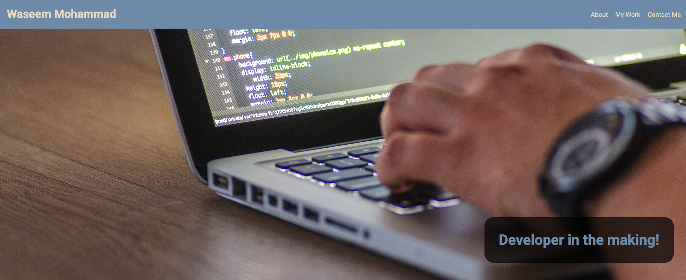

# Portfolio Page

## Description

The aim of this task was to create a portfolio webpage to showcase my work to potential employers. This will allow recruiters to look at my work which I been doing and as time goes on, this will be updated to show my latest work where I will also be able to see my own progress.

## Sample Image
The image below is a screenshot of what the web page looks like. 

## Review
This page has a responsive design created with grid and flexbox which is mobile frendly. The work area has a screenshot of the webpage created with a hover effect and once it is clicked, it will open a new tab to the linked page.  

## Project URL

[Portfolio Page - https://wmohammad83.github.io/portfolio](https://wmohammad83.github.io/portfolio)

## Resources Used
- [Font Awsome](https://fontawesome.com/) was used for the linkedin, instagram and mail icons
- The Roboto font was used from [Google Fonts](https://fonts.google.com/) to style the text on the page